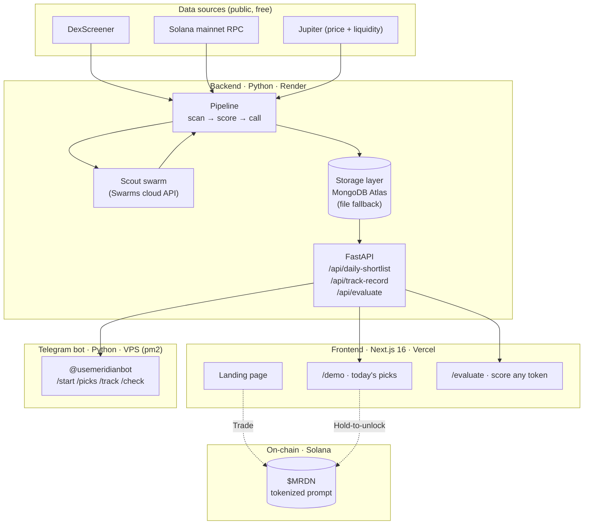

Meridian is a small, opinionated stack. Each piece is responsible for one thing; they share one read-only API contract.

## System diagram

## The pieces

<CardGroup cols={2}>
  <Card title="Backend" icon="server">
    Python 3.11+, FastAPI, hosted on **Render** (Docker). The swarm runs via the Swarms cloud API. Storage is **MongoDB Atlas** (free M0 tier) — survives Render's ephemeral filesystem. File fallback when `MONGODB_URI` isn't set (used in tests).
  </Card>
  <Card title="Frontend" icon="window">
    Next.js 16 (Turbopack), Tailwind 4, Motion, Reown AppKit (Solana). Hosted on **Vercel**. The `/demo` page is server-rendered with `force-dynamic` so it always shows fresh shortlist + track record from the API.
  </Card>
  <Card title="Telegram bot" icon="paper-plane">
    A thin Python client. Long-polls Telegram, calls the same FastAPI service. Runs anywhere with outbound HTTPS — typically a small VPS under **pm2**. ~250 lines.
  </Card>
  <Card title="Token" icon="coin">
    `$MRDN` lives on Solana, listed via **Swarms Marketplace** under Frenzy Mode. The hold-to-unlock gate on `/demo` uses Reown (Solana adapter) to read the connected wallet's $MRDN balance against the mint.
  </Card>
</CardGroup>

## Tech stack

| Layer | Choice | Why |
|---|---|---|
| Backend language | Python 3.11+ | Swarms SDK + httpx ecosystem |
| Web framework | FastAPI | Auto-generates OpenAPI → these docs' API tab |
| Storage | MongoDB Atlas (free tier) | Render's free disk is ephemeral; Atlas isn't |
| Test runner | pytest | Standard; deterministic mock swarm = no credit in CI |
| Frontend | Next.js 16 / Tailwind 4 / Motion | App router, Turbopack, animated UI |
| Wallet | Reown AppKit (Solana) | WalletConnect-compatible, multi-wallet |
| Bot | httpx long-polling | No new deps over the backend |
| Deploy | Render + Vercel + VPS | One free tier per surface |

## API contract

All public endpoints are documented live in the **[API Reference](api-reference)** tab — pulled from the FastAPI service's `/openapi.json` on every docs build. New endpoints appear without any MDX edit.

| Endpoint | Method | Auth | What |
|---|---|---|---|
| `/health` | GET | none | Heartbeat |
| `/api/daily-shortlist` | GET | none | Today's ranked picks |
| `/api/track-record` | GET | none | Hits / misses / open + recent calls |
| `/api/evaluate` | POST | none | Score any Solana mint on demand |
| `/api/run` | POST | `x-run-secret` | Regenerate the daily shortlist (admin) |

## Honesty by construction

The architecture is what makes the [honesty model](honesty-model) enforceable:

- **`calls.jsonl` is append-only.** No edit, no delete. The scorecard is derived on every read.
- **Three independent data sources.** One can fail or lag without fabricating a number — the gap propagates as `Unknown`.
- **Deterministic and live swarm share a rubric.** What `/evaluate` shows is what the daily call shows.

## Running it yourself

Everything's open source ([Enoch208/Meridian](https://github.com/Enoch208/Meridian)). The [quickstart](quickstart) self-host tab walks through running the bot locally; the repo README has the full backend + frontend deploy steps.
