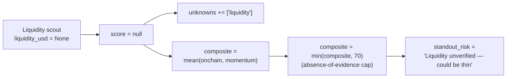

The honesty model is the reason Meridian's track record can be trusted. Without it, every other claim falls apart. These four rules are baked into every agent's system prompt **and** into the deterministic scorer that powers `/evaluate`.

## The four rules

<AccordionGroup>
  <Accordion title="1. Unknown is Unknown — never invented." icon="circle-question">
    If a signal can't be verified from the data, the scout returns **`null`**, marks the field in the `unknowns` array, and the composite **excludes** that scout from the average.

    No "let's estimate from the surrounding data." No "I'll set it to 50 as a neutral." If we don't know, we say we don't know — and the score is lower for it.

    **Why** — a 0 for missing data is a lie that compounds. The scouts agree to never tell that lie.
  </Accordion>

  <Accordion title="2. 'Worth investigating,' never 'buy.'" icon="circle-check">
    Every pick — every UI surface, every bot reply, every JSON response — is framed as research. The phrase **"worth investigating"** appears on the card. The phrase **"buy"** appears nowhere.

    **Why** — Meridian is a discovery layer, not a financial adviser. Telling someone what to buy is the wrong job and the wrong liability.
  </Accordion>

  <Accordion title="3. Always name the standout risk." icon="triangle-exclamation">
    Every positive pick must include a `standout_risk` string that names the single most important thing that could go wrong. *"Pair is young — unproven."* *"Thin liquidity — exit-rug risk."* *"Authorities not renounced — rug risk."*

    Omitting the risk on a positive pick is a **scoring error**, not a feature. The frontend and the bot both refuse to render a pick without one.

    **Why** — a positive call without a risk reads as a recommendation. With one, it reads as research.
  </Accordion>

  <Accordion title="4. Absence of evidence is a mild negative — not neutral." icon="scale-balanced">
    Missing liquidity, missing authorities, missing momentum data — none of these are treated as "we don't know, so call it 50." They tilt the verdict mildly down, because in crypto, the absence of a verifiable signal usually means it's bad and the source just hasn't caught up.

    Concretely: **unverifiable liquidity caps the composite at 70.** A clean on-chain + buyer-led momentum reading with Unknown liquidity can't read as "Strong."

    **Why** — neutral treatment of missing data is how scam tokens get high scores.
  </Accordion>
</AccordionGroup>

## How Unknown propagates

Here's what happens to a token whose liquidity isn't on any source:

Nothing gets fabricated. The gap is named on the card (`unknowns: ["liquidity"]`), the score is capped, and the risk language reflects the gap.

## Why this is the moat

A one-shot due-diligence tool can claim honesty, but it can never *prove* it — there's no track of how its past calls played out. Meridian's append-only [track record](track-record) makes the honesty model **verifiable**:

- Every call is logged with timestamp + score before its outcome is known.
- The scorecard (hits / misses / open) is derived from the log on every read.
- A bad call shows up. We don't selectively show wins because we can't.

If we ever invented a signal — or quietly dropped a missed call — the log would catch us out. That's the deal.
