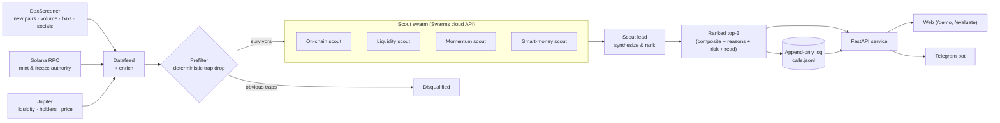

Meridian's pipeline is three phases, three data sources, and one rule that overrides everything else: **Unknown is Unknown — never invented.**

## The pipeline

## Phase 1 — Scan

The scouts ingest every new Solana pair the moment it appears. **Three sources are read in parallel:**

| Source | What it provides |
|---|---|
| **DexScreener** | New pairs, USD liquidity, volume, buy/sell tx counts, socials, token image |
| **Solana RPC** | Mint authority + freeze authority — the on-chain truth, not market metadata |
| **Jupiter** | Bonding-curve liquidity & price (where DexScreener lacks it), **holder count**, **top-holders %**, dev wallet, organic score, launchpad |

<Note>
  Jupiter is what lets Meridian score **brand-new launches and bonding-curve tokens** (e.g. swarms.world Frenzy Mode) the moment they appear — DexScreener often has the pair but no LP liquidity for a curve-only token. Jupiter reads the curve directly.
</Note>

Every numeric field that's missing comes through as `None`. There is no silent zero, no "0 means missing."

## Phase 2 — Score

Survivors of the prefilter hit the **scout swarm**: three live specialist agents + a lead. Each scout grades only the one signal it owns; the lead synthesizes them.

The swarm runs in two modes:

| Mode | Where it's used | Cost |
|---|---|---|
| **Deterministic (mock)** | `/evaluate`, tests, demos | Free, instant |
| **Live (Swarms cloud API)** | The daily shortlist run | Credit-bearing (zero under Frenzy Mode) |

Both share the same rubric, the same honesty rules, and the same response shape — so the on-demand `/evaluate` is a faithful preview of what a daily call would look like.

See [The scouts](the-scouts) for what each scout watches, and [Scoring rubric](scoring-rubric) for how scores combine.

## Phase 3 — Call

The lead emits the day's top-3 with:

- a **composite score** (0–100)
- the **scout sub-scores** (with `null` for Unknown)
- the **two strongest reasons** the token surfaced
- the **single standout risk** (always named)
- a **plain-English one-line read**
- the list of **`unknowns`** (so gaps are explicit)

Each call is appended to a permanent log (`calls.jsonl` or MongoDB) with a timestamp and the score at-time-of-call. The [public track record](track-record) is **derived** from that log on every read.

## Why this architecture

- **Single-signal scouts are auditable.** A monolithic "evaluator" hides reasoning; a swarm shows it.
- **Three independent sources reduce single-vendor failure.** DexScreener missing a field? Jupiter fills it. Solana RPC down? The on-chain check degrades to Unknown rather than fabricating.
- **An append-only log is the only honest moat.** You can't selectively show wins if the source of truth is immutable and the scorecard is derived.

Next: [the scouts in detail](the-scouts).
