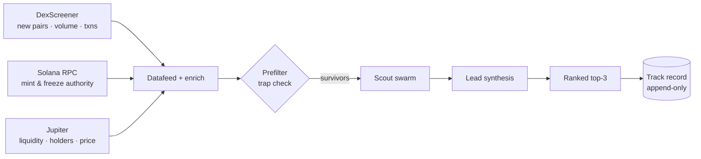

<Steps>
  <Step title="Scan">
    The scouts ingest every new Solana pair the moment it appears — pulling mint authorities, liquidity, momentum, and wallet flows into a single candidate stream. No manual scanning across a dozen tabs.
  </Step>
  <Step title="Score">
    Each scout grades the one signal it owns; a lead synthesizes them into one composite score against a [transparent rubric](scoring-rubric). Unverifiable signals are marked **Unknown** and down-weighted — never invented to justify a pick.
  </Step>
  <Step title="Call">
    The day's top picks are ranked with their strongest reasons, the standout risk, and a one-line read — then logged with a timestamp and score to the [public track record](track-record). Worth investigating, never financial advice.
  </Step>
</Steps>

## Pipeline

## Data sources

| Source | What it provides |
|---|---|
| **DexScreener** | New pairs, volume, buy/sell counts, socials, image |
| **Solana RPC** | Mint authority, freeze authority — the on-chain truth |
| **Jupiter** | Bonding-curve liquidity & price (where DexScreener lacks it), holder count, top-holders %, dev wallet, organic score |

Every source is public, read-only, and free. The combination is what lets Meridian score brand-new launches (including bonding-curve tokens DexScreener hasn't fully indexed yet) the moment they appear.
