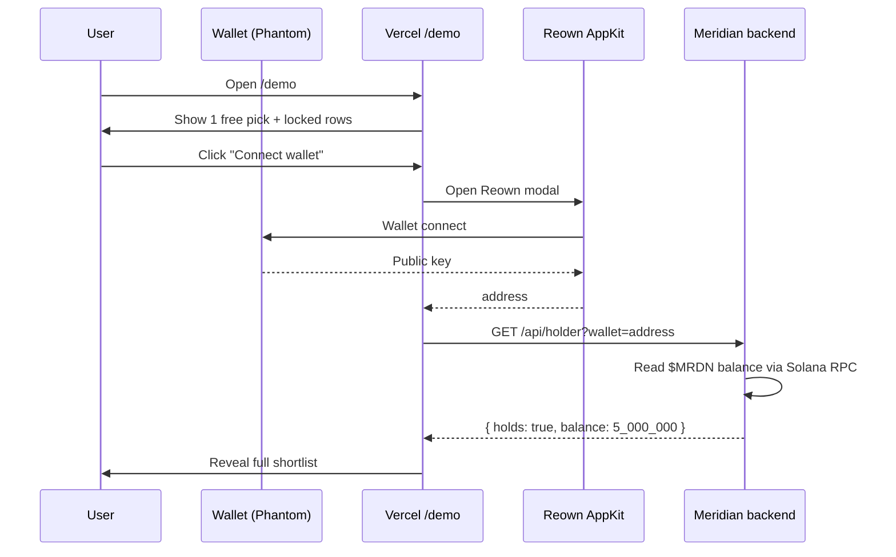

`$MRDN` is the **subscription** to Meridian's daily feed. Holding it unlocks the full ranked shortlist + live track record. Free tier proves the product works.

## On-chain

| Field | Value |
|---|---|
| **Ticker** | `$MRDN` |
| **Chain** | Solana |
| **Mint (CA)** | [`G7L2LRZyoE6FZgFo51Betj88UPMdnNi1iYmBrpfpswrm`](https://solscan.io/token/G7L2LRZyoE6FZgFo51Betj88UPMdnNi1iYmBrpfpswrm) |
| **Pool** | [`Ha8Gs6P4BZAu3iu6ZAZj2PoA9xkA1Lf5mum5FjsdtnHh`](https://solscan.io/account/Ha8Gs6P4BZAu3iu6ZAZj2PoA9xkA1Lf5mum5FjsdtnHh) |
| **Supply** | 1,000,000,000 |
| **Mint authority** | Renounced ✅ |
| **Freeze authority** | Renounced ✅ |
| **Launchpad** | swarms.world (Frenzy Mode) |

## Why hold it

Meridian's core utility is **daily and recurring**, not one-shot. Every day brings a new ranked call and a new entry in the public track record. Holding `$MRDN` is the subscription:

| Tier | What you get |
|---|---|
| **Free** | A delayed / partial shortlist — enough to prove the product works |
| **Holder (`$MRDN`)** | The full ranked shortlist in **real time** + the live track record |

Because value compounds with each day's call and each appended record, holding is **rational** rather than purely speculative — the defense against the churn one-shot tools see.

## The hold-to-unlock flow

Holding is checked on-chain at request time — no enrollment, no sign-up, no centralized whitelist. The instant the wallet shows a `$MRDN` balance, the feed unlocks.

<Note>
  The gate is on the web `/demo` page. The Telegram bot serves the same data publicly through the API — holder-gated content stays web-side.
</Note>

## Frenzy Mode

`$MRDN` launched on swarms.world via **Frenzy Mode**: a bonding-curve launchpad that pairs zero-cost listing (under Frenzy) with on-chain LP and on-day liquidity. The pair sits on Meteora's "Dynamic Bonding Curve" — that's why DexScreener has the pair but no `liquidity.usd` (it's not a standard LP). [Jupiter reads the curve directly](how-it-works#data-sources), which is how the `/evaluate` page surfaces the real liquidity number.

## Trade / view

<CardGroup cols={3}>
  <Card title="Trade on Swarms" icon="cart-shopping" href="https://swarms.world">
    The marketplace listing — buy on the bonding curve.
  </Card>
  <Card title="Solscan" icon="link" href="https://solscan.io/token/G7L2LRZyoE6FZgFo51Betj88UPMdnNi1iYmBrpfpswrm">
    On-chain explorer: holders, transfers, mint info.
  </Card>
  <Card title="DexScreener" icon="chart-line" href="https://dexscreener.com/solana/Ha8Gs6P4BZAu3iu6ZAZj2PoA9xkA1Lf5mum5FjsdtnHh">
    Live chart + price.
  </Card>
</CardGroup>

## What `$MRDN` doesn't do

- **It doesn't entitle you to financial advice.** Every pick stays *worth investigating*, never *buy.*
- **It doesn't promise a return.** The token's value tracks the credibility of the daily call. If the swarm makes bad calls, the track record will show it.
- **It's not used to pay for anything inside the product.** No "burn to access" mechanic. Holding is the gate; the gate is read-only.

<Warning>
  Worth investigating — never financial advice. The supply, mint, freeze, launchpad, and pool address above are verifiable on-chain by anyone with [Solscan](https://solscan.io/token/G7L2LRZyoE6FZgFo51Betj88UPMdnNi1iYmBrpfpswrm).
</Warning>
